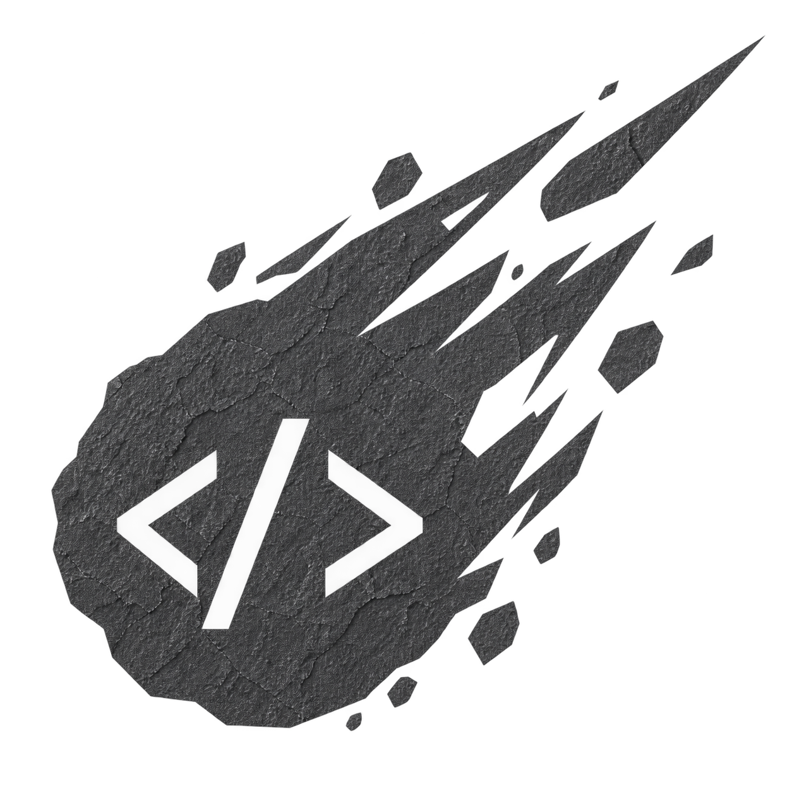

<p align="center">
    </p>
  <h1 align="center">Basalt Programming Language</h1>
  <p align="center">
    
    
    
    <a href="LICENSE"></a>
  </p>
</p>

---

## Table of Contents

- [Overview](#overview)
- [Why Basalt?](#why-basalt)
- [Highlights](#highlights)
- [Features](#features)
- [Code Samples](#code-samples)
- [Repository Layout](#repository-layout)
- [Getting Started](#getting-started)
- [Testing](#testing)
- [Portability & Safety](#portability--safety)
- [Roadmap](#roadmap)
- [Contributing](#contributing)
- [Acknowledgments](#acknowledgments)
- [License](#license)
- [Contact](#contact)

---

## Overview

**Basalt** is a small, self-hosting programming language and C compiler. The project ships **two implementations of the same language pipeline**:

- an **OCaml Host compiler** &mdash; the reference implementation, and
- a **Bootstrap compiler** &mdash; written in Basalt itself.

Both compilers parse Basalt source, perform static type checking, and emit portable **C11**. The Bootstrap compiler is verified by a *fixed-point* pass: the C output of generation `n2` must be byte-identical to the C output of generation `n3`. That guarantee is what makes Basalt genuinely self-hosted.

The repository is organized for **reproducible compiler work**, not for generated build output. Source code lives under `src/`, tests under `tests/`, the project overview in `README.md`, and repeatable development commands under `scripts/`.

---

## Why Basalt?

* **Self-hosting, for real.** Two cooperating compilers, a frozen C seed, and a deterministic fixed-point check &mdash; not just a transpiler demo.
* **Memory safety without garbage collection.** Compile-time bounds checks, move/borrow tracking for dynamic arrays, and an explicit `option` type make absence total.
* **C-grade control with modern ergonomics.** You can drop down to raw pointers, `extern`, and `includec` when you need to, then return to a checked language.
* **A serious standard library.** Containers, text, paths, filesystem, time, processes, concurrency, formatting, randomness, structured I/O &mdash; all under explicit namespaces with `Result`/status checks.
* **Reproducible from source.** Every script is versioned. Every test is committed. Build directories and generated outputs are deliberately excluded from version control.

---

## Highlights

**Language surface.** Integers (with explicit widths), booleans, characters, strings, floating-point values (`f32`/`f64`), pointers, fixed and dynamic arrays, structs, enums with payloads, namespaces, generic types, function pointers, and controlled C FFI through `extern`, `include`, and `includec`.

**Standard library.** A namespace-qualified library covering `array`, `slice`, `map`, `set`, `deque`, `iter`, `option`, `result`, strings, paths, filesystem, time, processes, concurrency, formatting, randomness, I/O, and structured system execution.

**Safety is a first-class concern:**

- **Compile-time bounds checks for fixed arrays.** Indexing `T[n]` with a constant outside the array is rejected before any C is emitted &mdash; including the `0 - 1` form of `-1`.
- **Bootstrap static borrow checking.** The self-hosted compiler tracks shared borrows (`&place`), mutable borrows (`&mut place`), `move` interaction, mutable reborrows such as `&mut *p`, lexical scope release, control-flow state, and borrowed-reference return/escape contracts. Active borrows block conflicting mutation, move, or release until their lexical owner ends.
- **Move/borrow checking for dynamic arrays.** Values own their buffers; passing them *moves* them, releasing *consumes* them, and borrows (`&`) block mutation, moves, and release while live.
- **Null safety through `option`.** The `option::Option<T>` module (tag + payload) makes absence explicit and total &mdash; the only way to read the payload is `unwrap_or`, so there is no panic path.
- **Runtime fail-closed policy.** Tracked allocations are registry-checked; invalid bounds and double releases terminate deterministically with exit code `2`.
- **UTF-8 done correctly.** `str::byte_len` / `str::len` count encoded bytes, `str::byte_at` uses byte offsets, and `str::codepoint_len` / `str::codepoint_at` operate on decoded Unicode scalar values. `str::utf8_validate` rejects malformed, overlong, surrogate, truncated, and out-of-range encodings.

**Compiler internals.** The Bootstrap compiler's built-in function table is data-driven (`bi_register(name, tag, flags)`), so adding a built-in is a **two-line change** across the two compilers instead of edits to several hardcoded hash lists.

**Arithmetic operators.** `+`, `-`, `*`, `/`, and the modulo operator `%`. Modulo has multiplicative precedence and is accepted by both the Host and Bootstrap compilers:

```basalt
func main(): int {
  let residue: int = (17 + 8) % 5;
  return residue;
}
```

> **Implementation note:** Basalt emits C11 and validates generated programs with strict GCC diagnostics. Floating-point arithmetic follows the current compiler rules; `%` is intended for integer operands in portable generated C.

---

## Features

* Intuitive C-family syntax with explicit types
* Static type checking with scope-aware resolution
* Bootstrap static borrow checking (`&`, `&mut`, reborrow, lexical lifetime, return/escape analysis)
* Ownership tracking for dynamic arrays (move / borrow / release)
* Compile-time fixed-array bounds checks
* Generic containers and algorithms
* Function pointers and closures
* Enums with payloads and exhaustive `match`
* Namespaces with lexical scoping
* Controlled C interop (`extern`, `include`, `includec`)
* Standard library: containers, text, paths, FS, time, process, concurrency, formatting, randomness, structured I/O
* `Result` / `Option` as the canonical error and absence types
* REPL-friendly interpreter optionality

---

## Code Samples

### Hello, World

```basalt
func main(): int {
  print "Hello, World!";
  return 0;
}
```

### Functions, arithmetic, and control flow

```basalt
func add(a: int, b: int): int {
  return a + b;
}

func main(): int {
  let x: int = 10;
  let y: int = 20;

  print x + y;
  print x - y;
  print x * y;
  print x / y;
  print x % y;

  if x > y then print "X is greater";
  elif x < y then print "Y is greater";
  else print "X equals Y";

  for i = 1 to 10 {
    print i;
  }

  let mut a: int = 1;
  while a < 100 {
    a = a + 1;
  }
  print a;

  return add(5, 3);
}
```

### Enums with payloads and `match`

```basalt
enum Message {
  Quit,
  Move { x: int; y: int; },
  Write { code: int; },
};

func classify(message: Message): int {
  let result: int = 0;
  match message {
    Quit => { result = 1; }
    Move(x, y) => { result = (x * 10) + y; }
    Write(code) => { result = code; }
  }
  return result;
}

func main(): int {
  let moved: Message = Message::Move(3, 4);
  if classify(moved) != 34 then return 1;
  return 0;
}
```

### `Option` &mdash; explicit absence, no panics

```basalt
include "../../src/stdlib/option.basalt"

func main(): int {
  let present: option::Option<int> = option::some(42);
  let absent:  option::Option<int> = option::none(0);

  print option::is_some(present);
  print option::is_none(absent);
  print option::unwrap_or(present, 7);
  print option::unwrap_or(absent,  7);

  let s: option::Option<string> = option::some("hello");
  print option::unwrap_or(s, "fallback");
  return 0;
}
```

For a full overview of the language surface, see the [`tests`](tests) folder and this README.

---

## Repository Layout

| Path | Contents |
| --- | --- |
| `src/compiler/` | OCaml Host compiler, Dune metadata, lexer, parser, type checker, AST, and C emitter |
| `src/bootstrap/` | Canonical self-hosting Basalt compiler source, generated C bootstrap artefact, and fixed-point checksum |
| `src/stdlib/` | Generic containers, text/path APIs, OS boundaries, concurrency, formatting, randomness, and standard library modules |
| `tests/regression/` | Focused language and compiler regression programs |
| `tests/stress/` | The stress corpus, dedicated borrow-flow stress fixtures, modulo stress, and negative tests |
| `tests/conformance/` | Host/Bootstrap conformance programs and runner material |
| `tests/adversarial/` | Sanitizer-oriented and adversarial compiler tests |
| `tests/benchmark/` | Cross-language benchmark source material |
| `scripts/` | Build, test, and fixed-point commands |

---

## Getting Started

### 1. Prerequisites

* **OCaml** &geq; 4.14 with `dune` and `ocamlfind`
* **GCC** with strict C11 support (or **Clang** as an alternative)
* **Bash** for the development scripts
* Python 3 (used by a few repo utilities)

### 2. Clone the repository

```bash
git clone https://github.com/memeviber/Basalt.git
cd Basalt
```

### 3. Build the Host compiler (OCaml)

```bash
./scripts/build.sh
```

This invokes Dune in `src/compiler/` and produces the Host executable at
`src/compiler/_build/default/bin/basaltc.exe`. The compiler accepts a Basalt
source path and writes the generated C file beside the source, using the source
filename with `.c` appended.

```bash
./src/compiler/_build/default/bin/basaltc.exe path/to/program.basalt
```

### 4. Build and verify the Bootstrap compiler (self-hosted)

```bash
./scripts/fixed_point.sh
```

The script:

1. Uses the **frozen previous-generation compiler** (`basaltc.seed.c`) to translate the evolving `basaltc.basalt` source into `n2.c`.
2. Compiles `n2.c` with strict GCC flags and runs it again to produce `n3.c`.
3. Compares `n3.c` with a fourth generation `n4.c` using `cmp` &mdash; they **must** be byte-identical.
4. Verifies the frozen seed checksum against `fixed_point_production.sha256`.

A successful run proves that the Bootstrap compiler is genuinely self-hosted.

### 5. Strict compiler profile

The strict warning profile used everywhere in the repo is:

```bash
gcc -std=c11 -Wall -Wextra -Wpedantic -Wconversion -Wshadow -Werror
```

---

## Testing

The master verification command is:

```bash
./scripts/run_ownership_stress.sh
```

It:

1. Builds the current Bootstrap compiler from the frozen C seed.
2. Runs the move/borrow and standard-library ownership fixtures under **ASan/UBSan** with leak detection.
3. Requires invalid ownership fixtures to be rejected.
4. Runs the regression, stress, adversarial, conformance, and fixed-point suites.
5. Asserts that no executable is left under `tests/`.

The stdlib fixtures cover file/path/string ownership, time/process/format/random boundaries, concurrency handles, and iterator/container lifecycles.

The individual suites can be run directly:

```bash
./scripts/run_regression.sh
./scripts/run_conformance.sh
./scripts/run_adversarial.sh
./scripts/run_stress.sh
./scripts/fixed_point.sh
```

The regression suite compiles and executes every registered fixture through the Bootstrap compiler with strict GCC: valid programs must compile and run; `expect_reject` fixtures must be rejected. The specification suite validates the borrow diagnostics for shared/mutable conflicts, temporary borrows, const places, return escapes, and ambiguous lifetimes. Selected stdlib and borrow fixtures are also compiled with strict Clang and sanitizer builds.

The corpus covers collection growth and hashing, iterator callbacks, stable sorting, UTF-8/string boundaries, path normalization, text filesystem errors, time validation, secure `argv` process handling, mutex/cancellation, typed formatting, deterministic PRNG behavior, and ownership cleanup.

---

## Portability & Safety

Generated code is checked with **strict C11 warnings under GCC and Clang** and is exercised with **AddressSanitizer** and **UndefinedBehaviorSanitizer** in the ownership, adversarial, and stress workflows. Dynamic-array allocation, resizing, indexing, mutation, and release use checked runtime helpers with registry validation, overflow guards, lifetime checks, and deterministic failure on invalid bounds. Filesystem, process, time, concurrency, and entropy APIs are explicit OS boundaries with `Result` / status checks; text file reads are not a binary-buffer abstraction, process handles must be reaped before release, and unsupported Windows capabilities return documented errors rather than being emulated unsafely.

The Bootstrap compiler now provides **static lexical borrow checking for its tracked language surface**. A binding created from `&place` is shared, while `&mut place` requires a mutable place and creates an exclusive capability. The checker propagates provenance through dereference, field/index places, reborrow, direct/generic named calls, and borrowed-reference returns; it also merges moved/borrowed state conservatively across `if`, `while`, and `for`. Diagnostics 37, 68, 69, 70, and 72 cover active-loan conflicts, non-place borrows, inconsistent return lifetimes, invalid mutable places, and local-reference escapes respectively. The current model intentionally uses a conservative root-place policy rather than disjoint field/index loans, and it treats raw pointer dereference, pointer arithmetic, `extern`, and `includec` as explicitly low-level interoperability boundaries that must be validated with sanitizers.

The repository intentionally excludes compiler build directories, generated test outputs, caches, and local binaries from version control.

---

## Roadmap

* [x] OCaml Host compiler (reference implementation)
* [x] Self-hosted Bootstrap compiler with fixed-point verification
* [x] Ownership checking (move / borrow / release)
* [x] Bootstrap static borrow checking (shared/mutable loans, reborrow, lexical lifetime, flow state, return/escape analysis)
* [x] Compile-time fixed-array bounds checks
* [x] `option` and `result` types
* [x] Standard library: containers, text, paths, FS, time, process, concurrency, formatting, randomness
* [x] AddressSanitizer + UndefinedBehaviorSanitizer workflows
* [x] Strict C11 warning profile under GCC and Clang
* [ ] Package manager (the implementation and offline suite are absent from this upstream snapshot)
* [ ] Incremental compilation cache
* [ ] Debugger and profiler integration
* [ ] VS Code language server and extension
* [ ] Cross-platform release artefacts (Linux, macOS, Windows UCRT64)

---

## Contributing

Contributions are welcome! To get involved:

1. Fork the repository.
2. Create a feature branch: `git checkout -b feature/my-feature`.
3. Commit your changes: `git commit -m "Describe feature"`.
4. Push the branch and open a Pull Request.

Please run the full verification suite locally before opening a PR:

```bash
./scripts/run_ownership_stress.sh
```

A PR that breaks the fixed-point check or the ownership/sanitizer suites will not be merged.

---

## Acknowledgments

Basalt is built on the shoulders of earlier language-tooling work. The Host compiler benefits from the OCaml ecosystem (`ocamllex`, `menhir`, `dune`); the standard library draws on long-standing C and POSIX conventions for paths, time, and process handling. The project is maintained and extended by **MemeViber (2025&ndash;2026)**.

Thanks to the authors of README best-practice references ([github.com][1], [en.wikipedia.org][2], [makeareadme.com][3]) for the documentation conventions adapted here.

---

## License

Basalt is released under the **MIT License**. See [`LICENSE`](LICENSE).

---

## Contact

* GitHub: [memeviber](https://github.com/memeviber)
* Issues: [github.com/memeviber/Basalt/issues](https://github.com/memeviber/Basalt/issues)

[1]: https://en.wikipedia.org/wiki/README "README"
[2]: https://github.com/jehna/readme-best-practices "Best practices for writing a README for your open source project - GitHub"
[3]: https://www.makeareadme.com/ "Make a README"